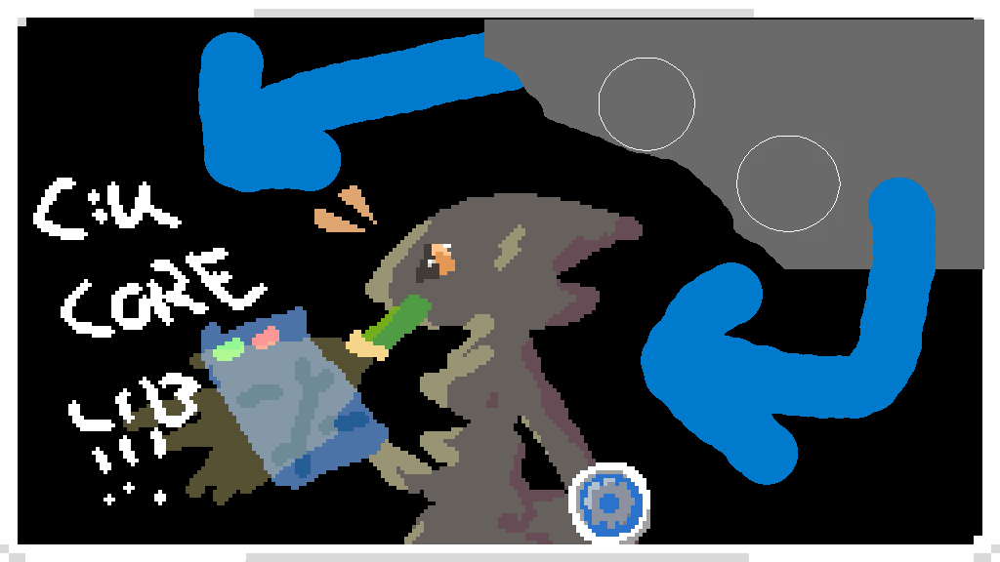

[中文指南](README_ZH.md)

> **⚠️ RshCCL is a compatibility bridge only.**
>
> Developers should always prefer using [CUCoreLib](https://github.com/jimmyking9999999/CUCoreLib) directly.
>
> Players should ask mod authors to migrate to CUCoreLib as their API dependency.

# RshCCL

[GitHub](https://github.com/CNCUMC/RshCCL) | [NexusMods](https://www.nexusmods.com/scavprototype/mods/403) | [CUCoreLib](https://github.com/jimmyking9999999/CUCoreLib)

_A compatibility bridge that forwards legacy RshLib API calls to
[CUCoreLib](https://github.com/jimmyking9999999/CUCoreLib) (CCL)._

---

## Overview

**RshCCL** is a drop-in replacement for RshLib *(in most cases)*. It keeps the
`Plugin.RegisterItem(string, RshItem)` API surface so older mods work
unchanged, while internally routing all registrations through CUCoreLib.

| Feature                               | How It Works                                                                                   |
|---------------------------------------|------------------------------------------------------------------------------------------------|
| `RegisterItem`                        | Converts `RshItem` → `CustomItemInfo`, then calls `ItemRegistry.Register`                      |
| `onSpawn` callback                    | Injected via CCL `SpawnComponents` + `RshSpawnCallback` MonoBehaviour                          |
| `krokMpEnabled` / `togetherMpEnabled` | Provided as backwards-compatible fields                                                        |
| Conflict avoidance                    | Removes self from `Chainloader.PluginInfos` so mods like NewClothing use their native CCL path |
| Console autofill                      | Patches `spawn` command to include every CCL-registered item                                   |
| Recipe-list crash guard               | Harmony finalizer catches NRE in `RefreshRecipeList`                                           |

---

## Installation

1. Install [BepInEx 5.x](https://github.com/BepInEx/BepInEx) for Casualties Unknown.
2. Install [CUCoreLib](https://github.com/jimmyking9999999/CUCoreLib) ≥ 1.0.1 —
   place `CUCoreLib.dll` in `BepInEx/plugins/`.
3. Download the latest `RshCCL.dll` from [Releases](https://github.com/CNCUMC/RshCCL/releases).
4. Place `RshCCL.dll` in `BepInEx/plugins/`.
5. **Remove** the old `RshLib.dll` if it exists.
6. (Optional) Install [Bark](https://github.com/CNCUMC/Bark) — offers enhanced localization support (auto-detect missing translations, multi-language generators).

> ⚠️ RshCCL uses the same BepInEx GUID as old RshLib (`com.rushellxyz.rshlib`).
>
> Only **one** `RshLib.dll` should be present in your plugins folder.

---

## Notes

RshLib itself never provided path or resource-loading APIs. Older mods that
hard-code paths like `"BepInEx/plugins/MyMod/image.png"` must update their
own resource-loading code.

Consider migrating to CCL's
[`AssetLoader`](https://github.com/jimmyking9999999/CUCoreLib) which resolves
paths relative to the calling DLL.

---

## Project Structure

```
RshCCL/
├── Plugin.cs          # Entry point: compatibility API + conflict avoidance
├── RshItem.cs         # Legacy RshItem type (backwards compat)
├── RshItemAdapter.cs  # RshItem → CustomItemInfo converter + onSpawn callback
├── Patches.cs         # ConsoleScript, GlobalDark, RefreshRecipeList guard
├── RshLib.csproj      # Project file (depends on CUCoreLib)
├── CHANGELOG.md       # English changelog
├── CHANGELOG_ZH.md    # Chinese changelog
├── README.md
└── README_ZH.md
```
